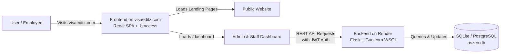

# 🚀 Render Backend & `visaeditz.com` Deployment Guide

This guide walks you through deploying your **Flask Backend to Render** and connecting it to your live frontend so that both the **Landing Website** and the **Full Dashboard** are active on **`visaeditz.com`**.

---

## 🏛️ Architecture Overview



- **Backend**: Hosted on **Render** as a Python Web Service (`https://<your-backend>.onrender.com`).
- **Frontend + Dashboard**: Hosted on **`visaeditz.com`** (Hostinger `public_html/`).
- **Communication**: The frontend calls your Render backend across HTTPS. CORS is already configured to accept all requests.

---

## 🛠️ STEP 1: Commit & Push Code to GitHub

All Render deployments pull directly from your GitHub repository (`sentmail2pradeesh-lab/Company-Website`).

In your terminal, run:

```bash
git add .
git commit -m "Configure Render backend deployment, gunicorn, and dynamic API baseURL"
git push origin main
```

---

## 🌐 STEP 2: Deploy Backend on Render

1. Log into your **Render Dashboard** ([dashboard.render.com](https://dashboard.render.com)).
2. Click the blue **New +** button in the top right $\rightarrow$ Select **Web Service**.
3. Under **Connect a repository**, choose **`sentmail2pradeesh-lab/Company-Website`**.
4. Configure the Web Service settings:
   - **Name**: `aszen-backend` (or `visaeditz-backend`)
   - **Region**: Choose the region closest to you (e.g., *Singapore* or *Frankfurt*)
   - **Branch**: `main`
   - **Root Directory**: `backend` *(CRITICAL: Type `backend` so Render looks inside the backend folder)*
   - **Runtime**: `Python 3`
   - **Build Command**: `pip install -r requirements.txt`
   - **Start Command**: `gunicorn app:app`
   - **Instance Type**: **Free**
5. Under **Environment Variables**, add:
   | Key | Value | Notes |
   |---|---|---|
   | `FLASK_ENV` | `production` | Enables production optimizations |
   | `SECRET_KEY` | *(Click Generate or type a secure random string)* | Encrypts session data |
   | `JWT_SECRET` | *(Click Generate or type a secure random string)* | Signs authentication tokens |
   | `FRONTEND_URL` | `https://visaeditz.com` | Your frontend domain |
   | `PYTHON_VERSION` | `3.11.9` | Ensures exact Python runtime |
6. Click **Create Web Service**.
7. Wait 2–3 minutes for the build to finish. Once Render shows **Live**, copy your live backend URL from the top of the page:
   ```text
   https://aszen-backend.onrender.com
   ```
8. **Verify Backend Health**:
   Open a browser tab to:
   ```text
   https://aszen-backend.onrender.com/api/health
   ```
   You should see: `{"status": "ok"}`.

---

## 💻 STEP 3: Build & Deploy Frontend with Dashboard to `visaeditz.com`

Now configure your frontend to use your live Render backend URL and upload the bundle to Hostinger.

### 1. Build the Frontend Locally
In PowerShell, open the `frontend` folder and build with your Render backend URL:

```powershell
cd d:\Company-Website\frontend
$env:VITE_API_URL="https://aszen-backend.onrender.com/api"
npm run build
```
*(Replace `https://aszen-backend.onrender.com` with your actual Render URL).*

### 2. Upload to Hostinger `public_html/`
1. Log into **Hostinger hPanel** $\rightarrow$ **Websites** $\rightarrow$ **Dashboard** for `visaeditz.com`.
2. Open **File Manager** $\rightarrow$ Enter `public_html/`.
3. Upload all files from your local `d:\Company-Website\frontend\dist\` folder into `public_html/`:
   ```text
   public_html/
   ├── index.html
   ├── .htaccess          <-- Ensures /dashboard routes don't return 404!
   ├── hero-reel.mp4
   ├── vistaeditz_logo.svg
   ├── visteditz_logo.svg
   ├── gallery/
   └── assets/
       ├── index-*.css
       └── index-*.js
   ```
   *(Select **Overwrite** if asked).*

> [!TIP]
> **Why the Dashboard Wasn't Showing Earlier**:
> In single-page React apps, refreshing or directly entering `https://visaeditz.com/dashboard` causes the server to look for a folder named `/dashboard`. The included `.htaccess` automatically routes all sub-paths back to `index.html`, allowing React Router to display the full Dashboard seamlessly.

---

## 🔐 STEP 4: Login & Verify Live Dashboard

1. Visit **`https://visaeditz.com/`**.
2. Click **Sign In** (or navigate to `https://visaeditz.com/dashboard`).
3. Sign in with the master administrator credentials:
   - **Email / Username**: `arun@aszen.com` (or simply `arun`)
   - **Password**: `Aszen@123`
4. You will be redirected into the **ASZEN Production Dashboard**:
   - **Dashboard Overview**: Stat cards, workload overview table, and today's jobs summary.
   - **Todays Jobs (`/dashboard/jobs`)**: 7-stage production tracking table (Blending, Path 1, Path 2, Editor 1, Editor 2, LC, FC).
   - **QC Pending Queue (`/dashboard/qc-pending`)**: Dedicated LC and FC approval cards.
   - **Production Sheets (`/dashboard/production-sheets`)**: Attendance and work sessions.

---

## ⚡ Optional: Free Managed Database (PostgreSQL)

By default, Render will use SQLite (`backend/aszen.db`), which initializes automatically on startup.

If you ever want a persistent cloud database that never resets on server rebuilds:
1. In Render Dashboard, click **New +** $\rightarrow$ **PostgreSQL**.
2. Name it `aszen-db`, select the **Free** tier, and click **Create Database**.
3. Copy the **Internal Database URL**.
4. In your `aszen-backend` Web Service, go to **Environment** $\rightarrow$ Add `DATABASE_URL` and paste the URL.
5. Render will automatically reconnect and build the tables on startup.
